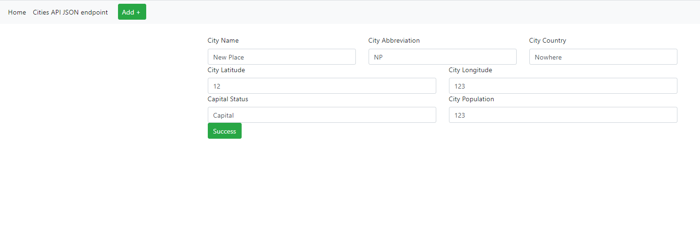
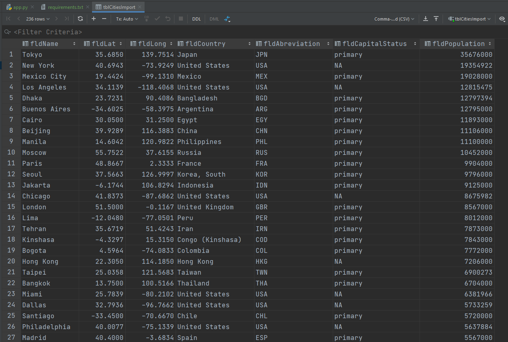
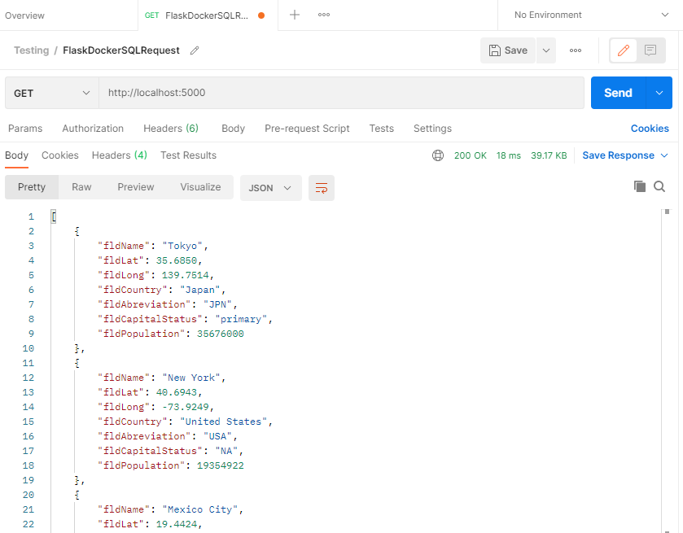

# Homework Part 3
## Images below
# Project Description
This project is a homework assignment to teach how to get Pycharm setup with Docker, Flask, MySQL

## HTML Card View (hw part 3)

## HTML New place being added (hw part 3)

## HTML New place added at the bottom (hw part 3)

## SQL Data Query (hw part 3)

## Postman Data Query (hw part 3)

## HTML Query Content (hw part 3)

