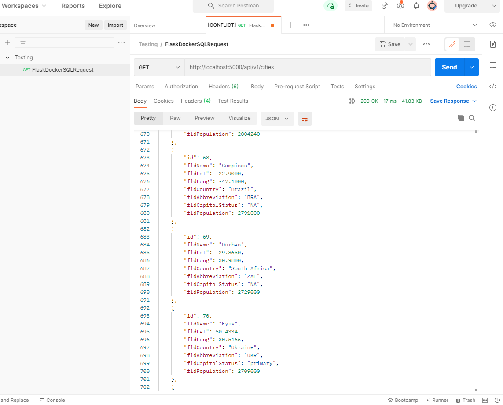
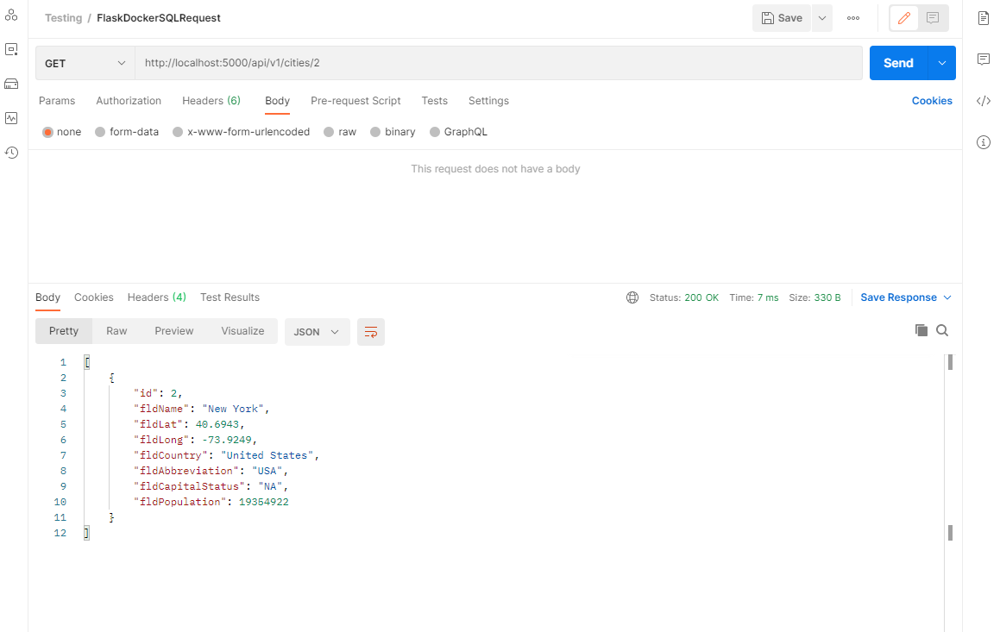
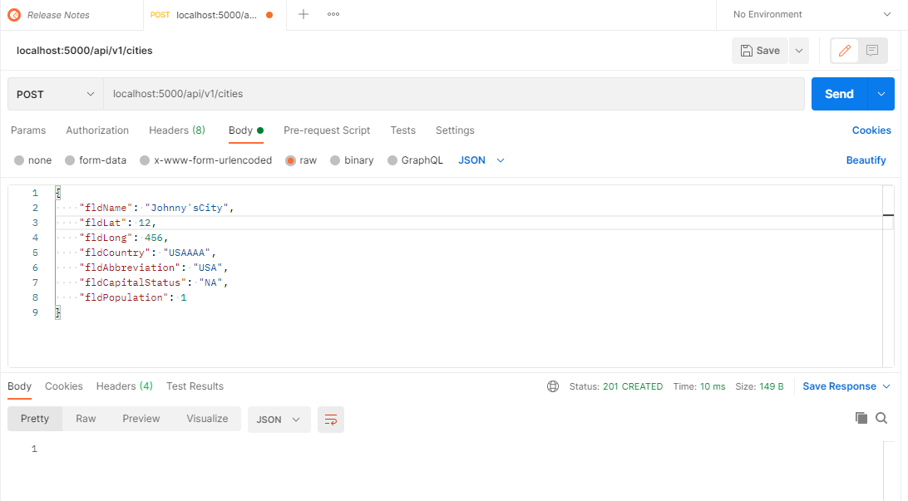
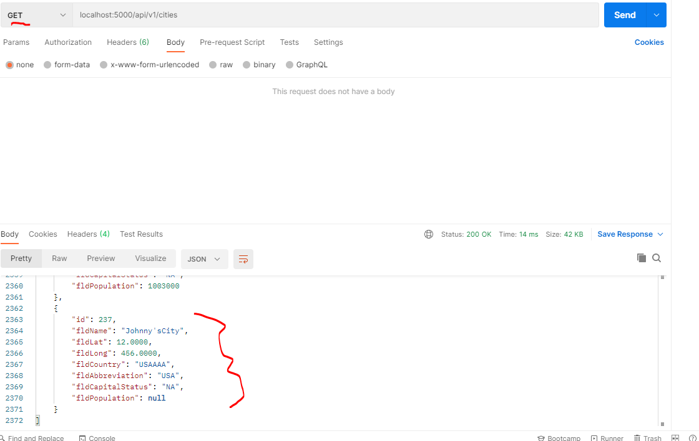
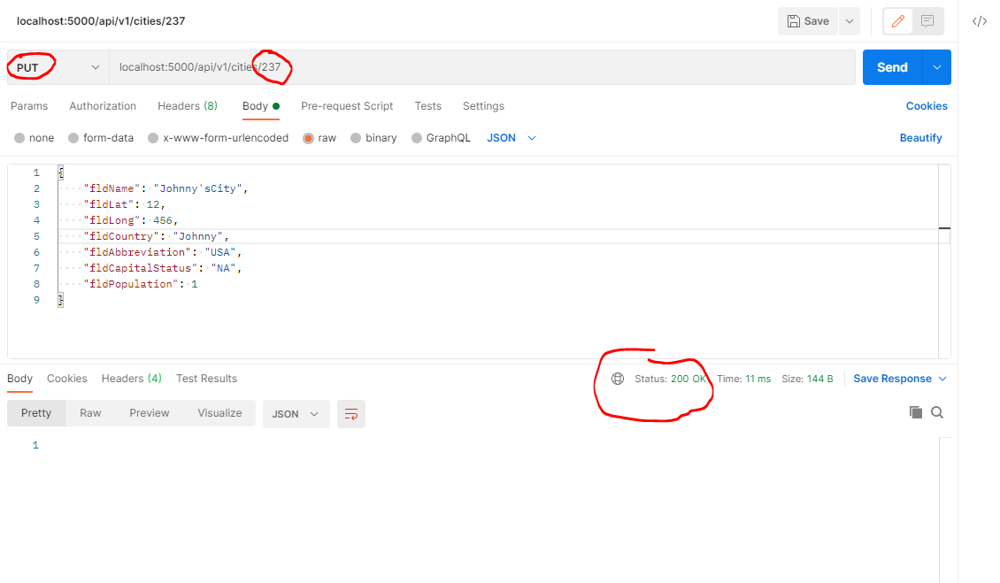
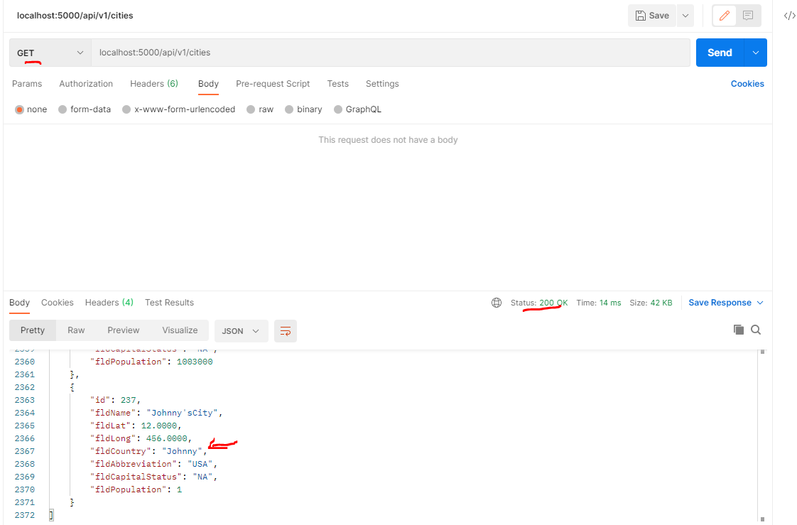
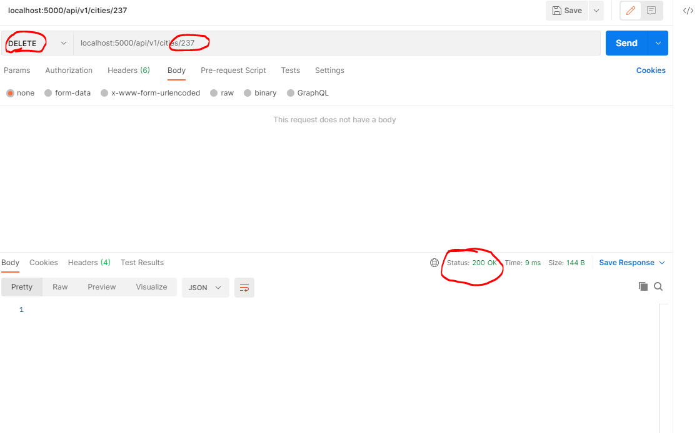
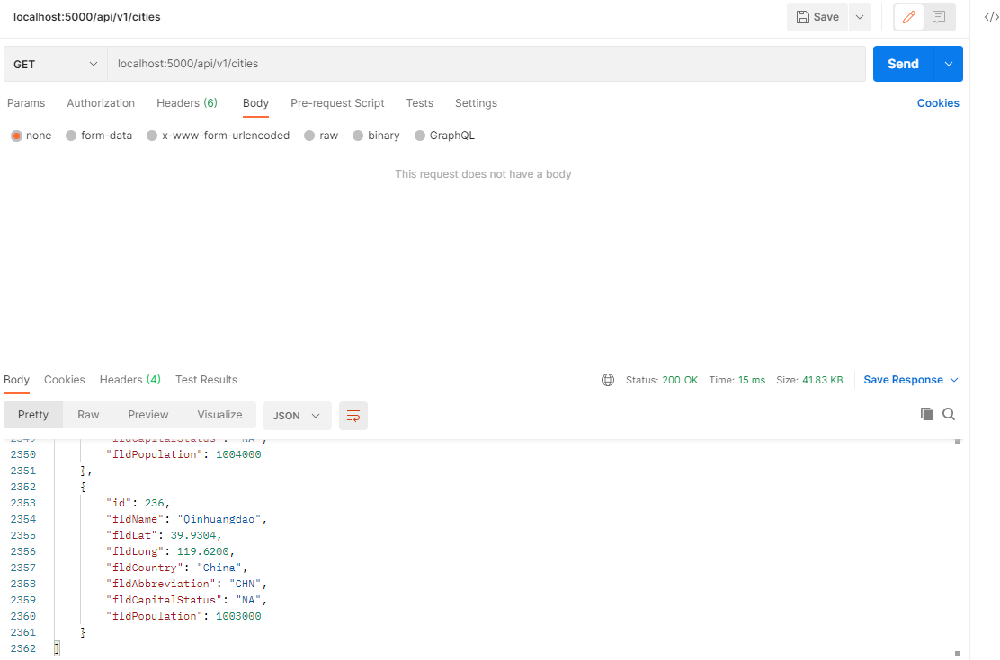

# Homework FINAL PART
## Images below
# Project Description
This project is a homework assignment to teach how to get Pycharm setup with Docker, Flask, MySQL

## 1. List of records on postman (final part)

## 2. One Record with GET request (final part)

## 3a. Creating a new City (final part)

## 3b. The new City in the record listing (final part)

## 4a. Editing a record with PUT (final part)

### 4b. Edited Record in List (final part)

## 5a. Deleting a Record with DELETE (final part)

## 5b. Record Deleted from list (final part)

