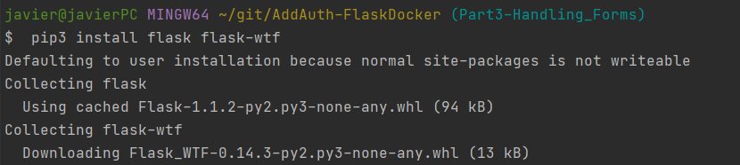
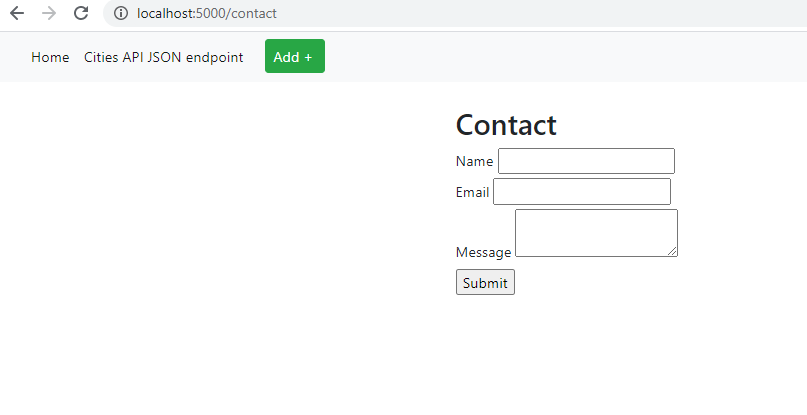
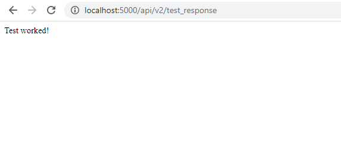
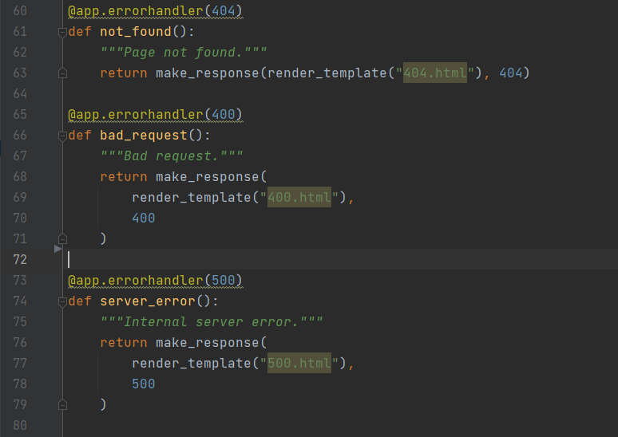
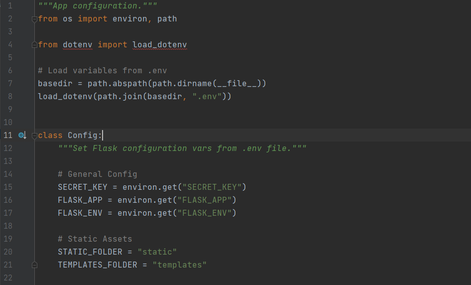
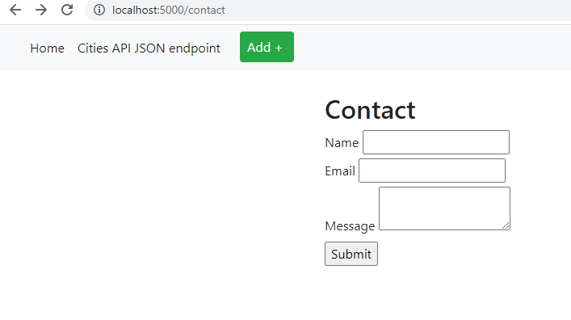
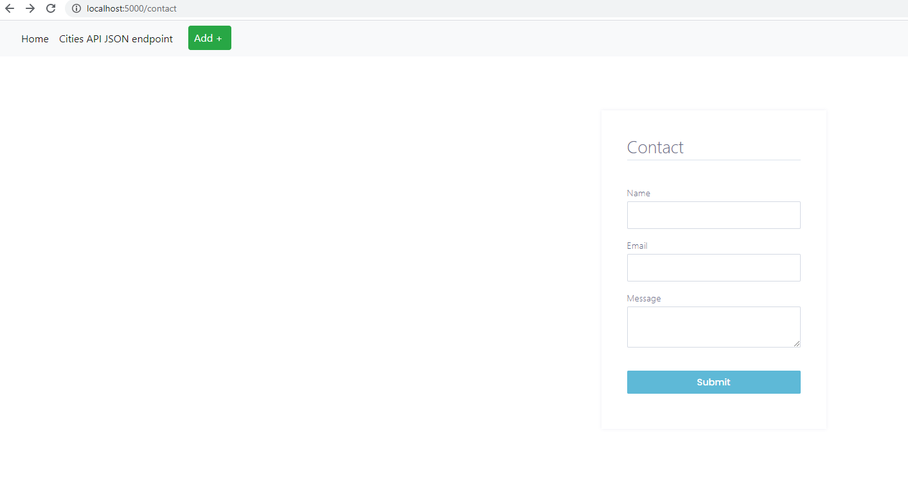
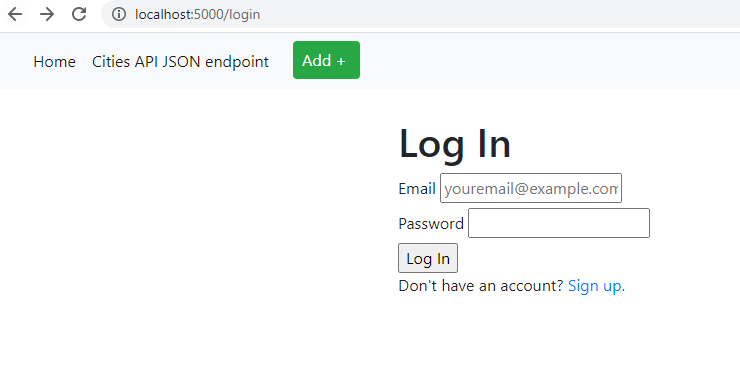

# Adding Authentication

# Part 1

#### Creating Flask application
#### (just used the existing Flask-Docker Application created for the previous homework)

# Part 2 

#### Rendering Pages in Flask
#### (used same html files for this step too)

# Part 3

#### Installing flask-wtf

#### Contact Form on Webpage

# Part 4

#### Testing Reponses

#### Error Handling

# Part 5

#### Configuration For Key

# Part 6

#### Separating Innit

# Part 7

#### Blueprints
#### created my own blueprint based of previous hw application

# Part 8

#### Frontend - Stylesheets Flask

#### Before CSS

#### After CSS

# Part 9

#### SQL Alchemy
#### used sql alchemy to make login form and keep track of users

# Part 10

#### Login Database

