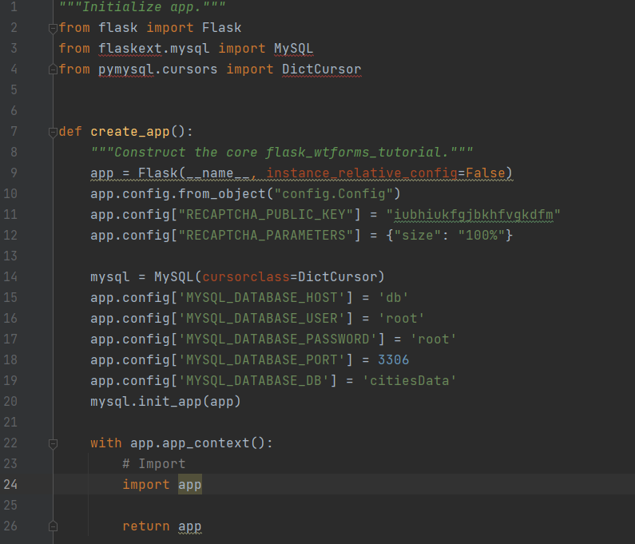

# Adding Authentication

# Part 3

#### Installing flask-wtf

#### Contact Form on Webpage

# Part 4

#### Testing Reponses

#### Error Handling

# Part 5

#### Configuration For Key

# Part 6

#### Separating Innit

# Part 7

#### Blueprints

